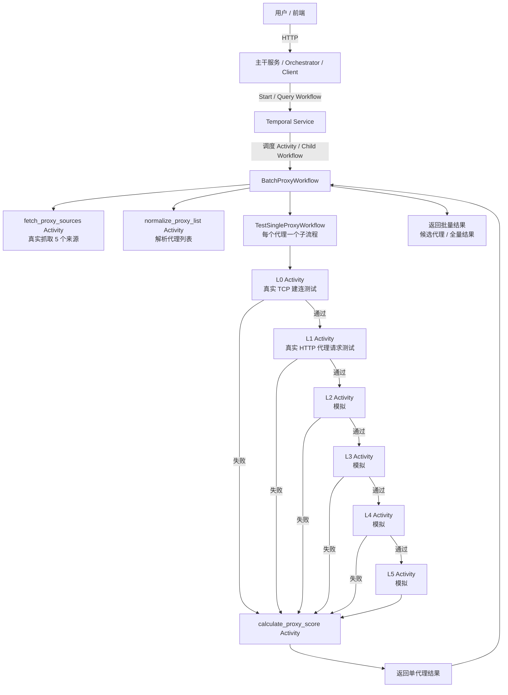
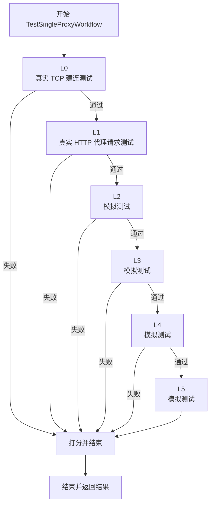

# 流程图

这个文件把 `iwakuniTemporal` 当前版本的核心流程，整理成可以直接在 GitHub 渲染的 Mermaid 图。

## 1. 整体通信图

## 2. 单个代理执行流图

## 3. 读图说明

当前版本的层级含义：

- `L0`：代理地址的 `host:port` 能否完成 TCP 建连
- `L1`：该代理能否真的转发一条 HTTP 请求
- `L2 ~ L5`：目前还是演示用模拟逻辑，后续可以逐层替换成真实测试

## 4. 为什么 Temporal 版适合这种图

因为在 Temporal 里：

- 批量流程是 `BatchProxyWorkflow`
- 单代理流程是 `TestSingleProxyWorkflow`
- 真正动作是 `Activity`

所以图画出来以后，和代码结构几乎是一一对应的。后续你继续扩展 L2 / L3 / 数据库写入 / 并发 child workflow 时，也比较容易继续维护这份图。
